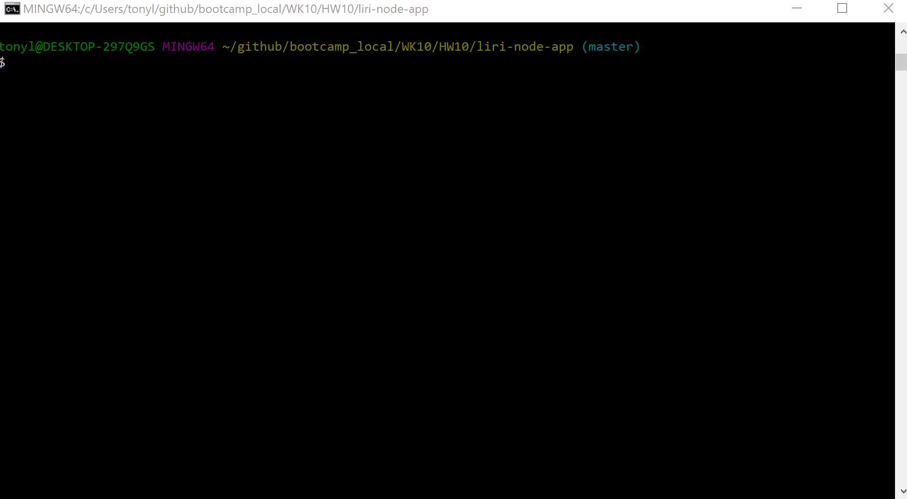
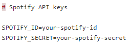

# liri-node-app
LIRI is a Language Interpretation and Recognition Interface.  LIRI will search Spotify for songs, Bands in Town for concerts, and OMDB for movies.  The user will enter command line parameter that LIRI will interpret and return the requested information.  Please see the parameter options below:
1. spotify-this-song [Your Song Name]
1. concert-this [Your Artist Name]
1. movie-this [Your Movie Name] 
1. do-what-it-says
# Demo
* 
## Setup
Liri.js is the main entry point for the app.  In order to run the app, you will need to clone this repository and install all requried technologies listed below.  In addition, you will need to request a spotify id that you will add to a .env file:
## Required Technologies
1.[Node.js](https://nodejs.org/en/)
1.[NPM](https://www.npmjs.com/get-npm)
1.[Git & Git Bash](https://git-scm.com/downloads)
## Installation Steps
1. Clone the liri-node-app
1. Install all required technologies
1. In bash, change the current directory to the liri-node-app and install all modules from the package.json, using the following command:
    1. install i [Enter]
1. Request a spotify id from [Spotify](https://developer.spotify.com/my-applications/#!/)
1. In the liri-node-app directory, create a file named .env and add your spotify-id and spotify-secret to the file, once 
you have them:
    1. 
##Execute the Program
1. Open bash, and execute the following commands in the liri-node-app directory:
    1. node liri.js spotify-this-song [Your Song Name] [Enter]
    1. node liri.js concert-this [Your Artist Name] [Enter]
    1. node liri.js movie-this [Your Movie Name] [Enter]
2. The do-what-it-says command reads from the random.txt file.  The random.txt file is in the liri-node-app directory.  It should contain two search parameters from the three options previously listed [ex. spotify-this-song I Want It That Way].  To execute the query, open bash, and type the command in the liri-node-app directory:
    1. node liri.js do-what-it-says [Enter]
## Use
This repo is available for public non-commercial use only.
## Goal
The goal of this project was to create a language interpretation app that queries the Spotify, Bands in Town, and OMDB APIS, using a command line interface.  
